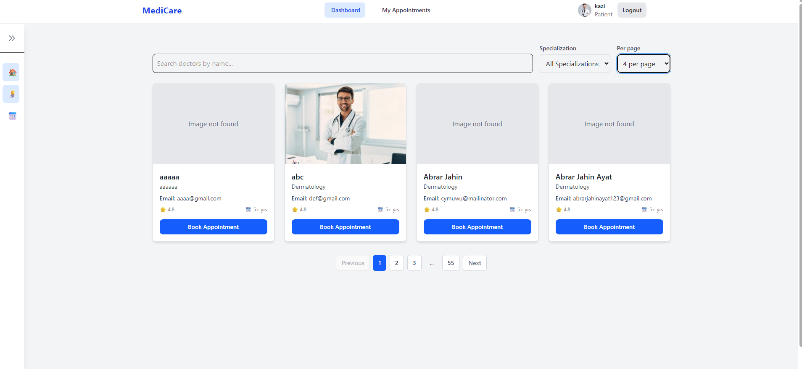
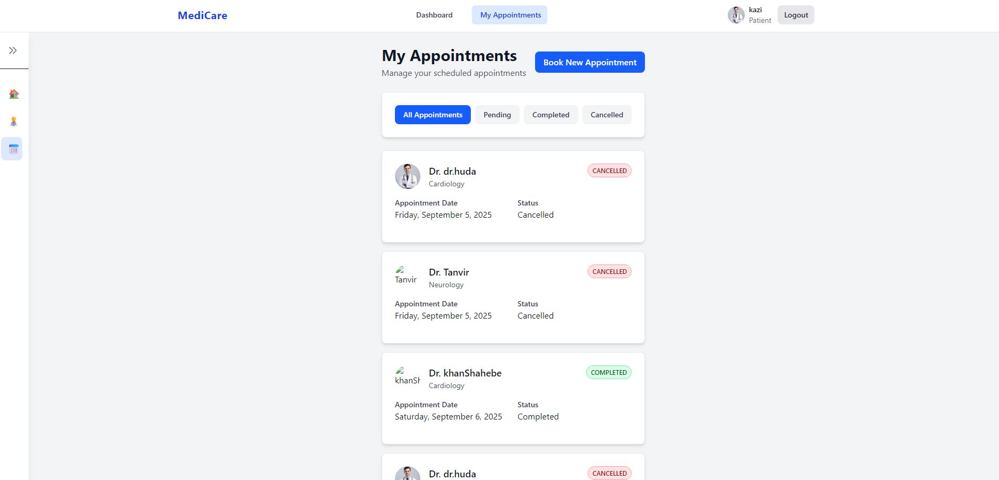

# Doctor Appointment Management System (Frontend)
A modern, responsive Doctor Appointment Management System frontend built with **React/Next.js**, **Tailwind CSS**, and modern frontend technologies.  
This project enables patients and doctors to register, log in, book appointments, manage schedules, and handle medical records efficiently.

---
## project live link: https://doctor-patient-appointment-systems.netlify.app/login
## 🏗 Overview

- **Login & Registration**
  - Login with email, password, and role selection (Patient/Doctor)
  - Patient registration: `name`, `email`, `password`, `photo_url` (optional)
  - Doctor registration: `name`, `email`, `password`, `specialization`, `photo_url` (optional)
  - Real-time form validation and error handling

- **Patient Dashboard**
  - Doctor list with search & filter by specialization
  - Book appointments with date picker and confirmation modal
  - View, filter, and cancel appointments

- **Doctor Dashboard**
  - Paginated appointment list with patient details
  - Update appointment status (Completed/Cancelled)
  - Filter appointments by date & status
  - Confirmation dialogs for safety

---

## ⚡ Tech Stack

- **Core:** React, Javascript, Tailwind CSS  
- **State Management:** Zustand 
- **Forms & Validation:** React Hook Form, Zod  
- **API Communication:** Axios, React Query (optional for caching & refetching)  

---
## Features

### Patient Dashboard
- **Book Appointments:** Search for doctors by specialization and book appointments with available doctors.
- **View Appointments:** See a list of upcoming, past, and cancelled appointments. Filter by status.
- **Medical Records:** Access your health records, view doctor notes, and download prescriptions (if enabled).
- **Messaging:** Securely communicate with your doctor about appointments or health concerns.

### Doctor Dashboard
- **Manage Appointments:** View all upcoming, completed, and cancelled appointments. Update appointment status.
- **Patient Information:** Access patient profiles, view medical history, and add notes or prescriptions.
- **Medical Records:** Update patient records, upload files, and share notes directly with patients.
- **Messaging:** Respond to patient queries and send important updates.

### Authentication
- **Role-based Login:** Separate login and registration for patients and doctors.
- **Secure Access:** JWT-based authentication ensures only authorized users can access their dashboard and data.

### Admin Features (Optional)
- **Specialization Management:** Add or update doctor specializations.
- **User Management:** View and manage registered users.

---

## Screenshots

<!-- Add your images here -->




---

## Tech Stack

- **Frontend:** React, Vite, Tailwind CSS
- **State Management:** Zustand, React Query
- **Backend:** Node.js, Express (API hosted separately)
- **Authentication:** JWT
- **Other:** Axios, Zod, React Hook Form

---

## 🚀 Installation & Usage

1. **Clone the repository:**

```bash
 git clone https://github.com/MunnaKhan99/Doctor-Appointment-Management-System.git
cd Doctor-Appointment-Management-System
```
2.**Install dependencies:**
```bash
npm install
```
3.**start the development server:**
```bash
npm run dev
```
4. **Manage your tasks:**
 Add new tasks, mark them as completed, delete them, and filter your list easily.
## 📂 Project Structure

```text
Doctor-Appointment-Management-System/
├── .git/
├── .gitignore
├── eslint.config.js
├── index.html
├── node_modules/
├── package-lock.json
├── package.json
├── public/
│   ├── doctor-login.jpg
│   ├── doctors.json
│   ├── index.json
│   └── vite.svg
├── README.md
├── src/
│   ├── App.css
│   ├── App.jsx
│   ├── assets/
│   │   └── react.svg
│   ├── components/
│   │   ├── demo/
│   │   ├── doctor/
│   │   │   ├── AppointmentStatusManager.jsx
│   │   │   ├── DoctorAppointmentCard.jsx
│   │   │   ├── DoctorAppointments.jsx
│   │   │   ├── DoctorAppointmentsDemo.jsx
│   │   │   ├── DoctorAppointmentsList.jsx
│   │   │   └── README.md
│   │   ├── forms/
│   │   │   ├── DoctorRegistrationForm.jsx
│   │   │   ├── LoginForm.jsx
│   │   │   └── PatientRegistrationForm.jsx
│   │   ├── layout/
│   │   │   ├── DashboardLayout.jsx
│   │   │   ├── EmptyState.jsx
│   │   │   ├── Grid.jsx
│   │   │   ├── Navbar.jsx
│   │   │   ├── PageContainer.jsx
│   │   │   ├── SearchFilterBar.jsx
│   │   │   ├── SidebarLayout.jsx
│   │   │   ├── StatsCard.jsx
│   │   │   └── UseBreakpoint.jsx
│   │   ├── Login/
│   │   │   ├── Login.jsx
│   │   │   ├── Register.jsx
│   │   │   └── RegisterForm.jsx
│   │   ├── modals/
│   │   │   └── BookingModal.jsx
│   │   ├── patient/
│   │   │   ├── AppointmentCard.jsx
│   │   │   ├── AppointmentsList.jsx
│   │   │   ├── DoctorCard.jsx
│   │   │   └── DoctorList.jsx
│   │   ├── ProtectedRoute.jsx
│   │   ├── realtime/
│   │   └── ui/
│   │       ├── Button.jsx
│   │       ├── Card.jsx
│   │       ├── ConfirmDialog.jsx
│   │       ├── Input.jsx
│   │       ├── Loading.jsx
│   │       ├── Modal.jsx
│   │       ├── Pagination.jsx
│   │       ├── SearchInput.jsx
│   │       ├── Select.jsx
│   │       ├── StatusFilter.jsx
│   │       └── Toast.jsx
│   ├── hooks/
│   │   ├── useAppointments.js
│   │   ├── useAuth.js
│   │   ├── useDoctorAppointments.js
│   │   └── useDoctors.js
│   ├── index.css
│   ├── lib/
│   │   ├── api.js
│   │   ├── auth.js
│   │   ├── toast.js
│   │   └── utils.js
│   ├── main.jsx
│   ├── pages/
│   │   ├── doctor/
│   │   │   ├── Dashboard.jsx
│   │   │   └── DoctorAppointmentsPage.jsx
│   │   └── patient/
│   │       ├── PatientAppointments.jsx
│   │       └── PatientDashboard.jsx
│   ├── services/
│   └── store/
│       ├── appointmentsStore.js
│       ├── authStore.js
│       └── doctorsStore.js
├── vite.config.js
```

## Api References
- **Base URL: https://appointment-manager-node.onrender.com/api/v1
- **/api/v1/auth/login - Login (returns JWT token and user info)
- **/api/v1/auth/register/patient - Register Patient
- **/api/v1/auth/register/doctor - Register Doctor
- **/api/v1/appointments - Book Appointment (patient)
- **/api/v1/appointments/doctor - Doctor's Appointments
- **/api/v1/appointments/patient - Patient's Appointments
- **/api/v1/records - Medical records (view/update)
- **/api/v1/messages - Messaging between patient and doctor 


## ⚖️ License
Let me know if you want even more technical details or want to add backend setup
Licensed under the MIT License – see the LICENSE file for details.

